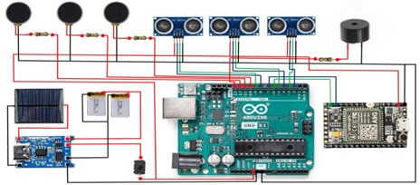
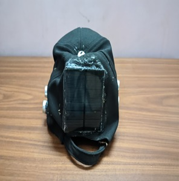
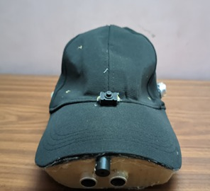

# NETRA: A Smart Cap for Blind People 
The Smart Cap for blind individuals is an innovative wearable device designed to assist with navigation and obstacle detection. Equipped with ultrasonic sensors, the cap detects nearby objects and alerts the user through vibrations or sound, helping them avoid collisions. It also features GPS tracking to provide real-time location data, enhancing safety and mobility. Powered by an Arduino, the system is lightweight, affordable, and easy to use. This cap aims to improve independence and confidence for visually impaired users in their daily activities.

<h4>Circuit Diagram:</h4>
<table>
  <tr>
    <td>
        
    </td>
  </tr>
</table>

<h4>Some images of our model:</h4>
<table>
  <tr>
    <td>
        
        
    </td>
  </tr>
</table>

 <h4>Referenes:</h4>
1. https://troindia.in/journal/ijcesr/vol7iss7/63-67.pdf

2.https://www.researchgate.net/publication/344507436_Ultrasonic_Sensor_based_Smart_Cap_as_Electronic_Travel_Aid_for_Blind_People
